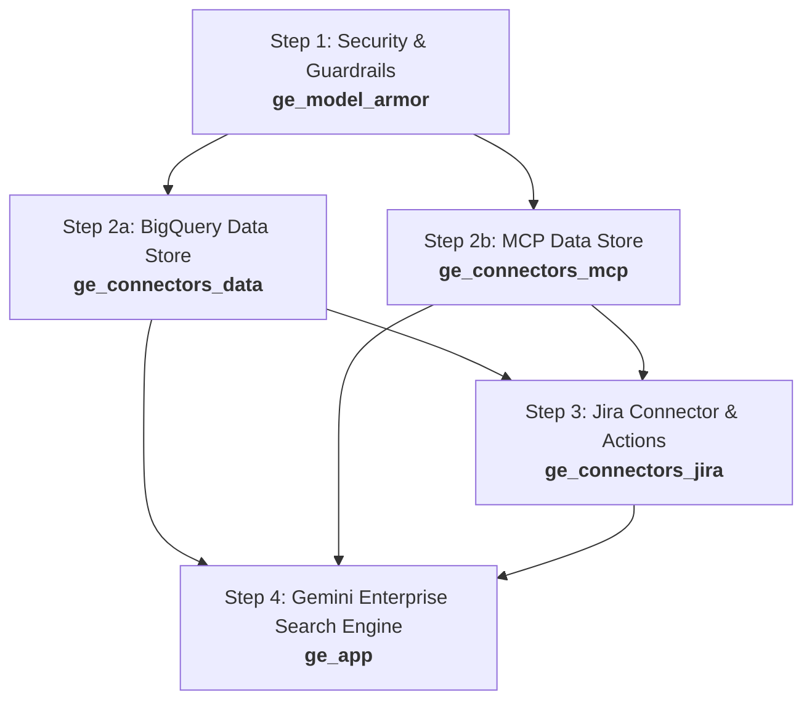

# Google Cloud Gemini Enterprise App Terraform Infrastructure

Comprehensive, modular Terraform configurations for provisioning and managing **Google Cloud Discovery Engine** (Gemini Enterprise) search applications, Data Stores, third-party data connectors (Jira, MCP, BigQuery), and **Model Armor** security guardrails.

---

## 📐 Architecture & Repository Overview

The infrastructure is organized into dedicated, modular directories to enable decoupled lifecycle management, independent deployments, and structured dependency ordering:

```
.
├── ge_model_armor/       # Step 1: Model Armor security guardrails & safety templates
├── ge_connectors_data/   # Step 2a: Discovery Engine Data Store for BigQuery (ecomm_events)
├── ge_connectors_mcp/    # Step 2b: Discovery Engine Data Store for MCP / Developer Docs
├── ge_connectors_jira/   # Step 3: Third-party federated Jira Data Connector with BAP actions
└── ge_app/               # Step 4: Main Gemini Enterprise Search Engine Application
```

---

## 🚀 Recommended Deployment Sequence

To satisfy resource dependencies (e.g., Data Stores must exist before being attached to the Search Engine) and establish security policies early, execute the Terraform modules in the following order:



### Module Execution Rationale & Dependencies

| Order | Module Directory | Purpose & Dependency Rationale |
| :---: | :--- | :--- |
| **1** | [`ge_model_armor`] | **Security & Guardrails Layer**: Provisions Model Armor templates, prompt injection/jailbreak detection, Responsible AI (RAI) safety filters, malicious URI checks, and SDP/PII inspection. Must be applied first to establish governance policies. |
| **2a** | [`ge_connectors_data`](NOT READY) | **Data Layer (BigQuery)**: Provisions the Discovery Engine Data Store for BigQuery structured e-commerce data (`ecomm_events`). Must be created before attaching to the search app. |
| **2b** | [`ge_connectors_mcp`](NOT READY) | **Data Layer (MCP Docs)**: Provisions the Discovery Engine Data Store for Model Context Protocol (MCP) developer documentation (`mcp_data`). Must be created before attaching to the search app. |
| **3** | [`ge_connectors_jira`] | **Integration Layer (Jira)**: Configures the federated Jira Data Connector with Business Application Platform (BAP) actions for issue management, comments, attachments, and status tracking. |
| **4** | [`ge_app`] | **Application Layer**: Provisions the Gemini Enterprise Search Engine app (`google_discovery_engine_search_engine`), links the Data Stores provisioned in Step 2, and enables enterprise platform features. |

---

## 📋 Prerequisites & Initial Setup

Before running any module, verify that the following prerequisites are met:

### 1. Tooling Requirements
- **Terraform CLI**: Version `>= 1.5.0`
- **Google Cloud SDK**: `gcloud` CLI installed and authenticated

### 2. Authentication & GCP Project Setup
Authenticate your local session with Google Cloud Application Default Credentials (ADC):
```bash
gcloud auth application-default login
```

Ensure your active GCP project has billing enabled and required APIs activated:
```bash
gcloud services enable \
  discoveryengine.googleapis.com \
  modelarmor.googleapis.com
```

### 3. Required IAM Roles
The executing identity requires the following minimum IAM roles on the GCP project:
- `roles/discoveryengine.admin` (Discovery Engine Admin)
- `roles/modelarmor.admin` (Model Armor Admin)

---

## 📂 Detailed Module Breakdown & Documentation

### 1. Model Armor Security Guardrails (`ge_model_armor`)
- **Directory Path**: [`ge_model_armor/`](file:///usr/local/google/home/kapsay/work/agy-cli-projects/ge-app-tf/ge_model_armor)
- **Primary Resource**: [`google_model_armor_template`](file:///usr/local/google/home/kapsay/work/agy-cli-projects/ge-app-tf/ge_model_armor/main.tf#L1) (using `google-beta` provider)
- **Key Files**:
  - [`main.tf`](file:///usr/local/google/home/kapsay/work/agy-cli-projects/ge-app-tf/ge_model_armor/main.tf) - Defines security filter configurations and enforcement settings.
  - [`variables.tf`](file:///usr/local/google/home/kapsay/work/agy-cli-projects/ge-app-tf/ge_model_armor/variables.tf) - Declarations for location, thresholds, and filter rules.
  - [`terraform.tfvars`](file:///usr/local/google/home/kapsay/work/agy-cli-projects/ge-app-tf/ge_model_armor/terraform.tfvars) - Default variable values for production guardrails.
  - [`providers.tf`](file:///usr/local/google/home/kapsay/work/agy-cli-projects/ge-app-tf/ge_model_armor/providers.tf) - Provider version declarations (`google-beta >= 7.3.0`).
- **Configured Features**:
  - **Prompt Injection & Jailbreak Detection**: Enforces detection for confidence level `MEDIUM_AND_ABOVE`.
  - **Malicious URI Filtering**: Enabled to detect harmful links in inputs/outputs.
  - **Responsible AI (RAI) Filters**: Active filtering for `HATE_SPEECH`, `HARASSMENT`, `SEXUALLY_EXPLICIT`, and `DANGEROUS` content (`MEDIUM_AND_ABOVE`).
  - **Sensitive Data Protection (SDP)**: Basic PII filter enforcement enabled.
  - **Template Metadata**: Set to `INSPECT_AND_BLOCK` mode with custom error code `400`, operation logging, and multi-language detection enabled.

---

### 2. BigQuery Data Store (`ge_connectors_data`)
- **Directory Path**: [`ge_connectors_data/`](file:///usr/local/google/home/kapsay/work/agy-cli-projects/ge-app-tf/ge_connectors_data)
- **Primary Resource**: [`google_discovery_engine_data_store.dc_bq`](file:///usr/local/google/home/kapsay/work/agy-cli-projects/ge-app-tf/ge_connectors_data/main.tf#L5)
- **Key Files**:
  - [`main.tf`](file:///usr/local/google/home/kapsay/work/agy-cli-projects/ge-app-tf/ge_connectors_data/main.tf) - Provisions BigQuery structured data store (`ecomm_events`).
  - [`variables.tf`](file:///usr/local/google/home/kapsay/work/agy-cli-projects/ge-app-tf/ge_connectors_data/variables.tf) - Data store variables, schema IDs, and layout parsing options.
  - [`terraform.tfvars`](file:///usr/local/google/home/kapsay/work/agy-cli-projects/ge-app-tf/ge_connectors_data/terraform.tfvars) - Data store configuration values.
- **Configured Features**:
  - **Data Store ID**: `ecomm-events_1780862168950` (Display Name: `ecomm_events`)
  - **Industry Vertical**: `GENERIC`
  - **Solution Types**: `SOLUTION_TYPE_SEARCH`
  - **Layout Parsing**: Disabled by default for optimized BigQuery structured event indexing.

---

### 3. MCP Developer Docs Data Store (`ge_connectors_mcp`)
- **Directory Path**: [`ge_connectors_mcp/`](file:///usr/local/google/home/kapsay/work/agy-cli-projects/ge-app-tf/ge_connectors_mcp)
- **Primary Resource**: [`google_discovery_engine_data_store.dc_mcp`](file:///usr/local/google/home/kapsay/work/agy-cli-projects/ge-app-tf/ge_connectors_mcp/main.tf#L5)
- **Key Files**:
  - [`main.tf`](file:///usr/local/google/home/kapsay/work/agy-cli-projects/ge-app-tf/ge_connectors_mcp/main.tf) - Provisions Model Context Protocol (MCP) data store.
  - [`variables.tf`](file:///usr/local/google/home/kapsay/work/agy-cli-projects/ge-app-tf/ge_connectors_mcp/variables.tf) - Data store properties and schema bindings.
  - [`terraform.tfvars`](file:///usr/local/google/home/kapsay/work/agy-cli-projects/ge-app-tf/ge_connectors_mcp/terraform.tfvars) - MCP data store settings (`kroger_demo_ds_mcp` / `mcp_data`).
- **Configured Features**:
  - **Data Store ID**: `developer-docs_1784867512211_mcp_data` / `kroger_demo_ds_mcp`
  - **Industry Vertical**: `GENERIC`
  - **Solution Types**: `SOLUTION_TYPE_SEARCH`
  - **Default Schema**: `default_schema`

---

### 4. Federated Jira Connector & BAP Actions (`ge_connectors_jira`)
- **Directory Path**: [`ge_connectors_jira/`](file:///usr/local/google/home/kapsay/work/agy-cli-projects/ge-app-tf/ge_connectors_jira)
- **Primary Resource**: [`google_discovery_engine_data_connector.jira-with-actions`](file:///usr/local/google/home/kapsay/work/agy-cli-projects/ge-app-tf/ge_connectors_jira/main.tf#L1)
- **Key Files**:
  - [`main.tf`](file:///usr/local/google/home/kapsay/work/agy-cli-projects/ge-app-tf/ge_connectors_jira/main.tf) - Configures Jira OAuth connector, destination endpoints, entities, and BAP actions.
  - [`variables.tf`](file:///usr/local/google/home/kapsay/work/agy-cli-projects/ge-app-tf/ge_connectors_jira/variables.tf) - Declarations for Jira authentication, entity indexing, and BAP connection parameters.
  - [`terraform.tfvars`](file:///usr/local/google/home/kapsay/work/agy-cli-projects/ge-app-tf/ge_connectors_jira/terraform.tfvars) - Credentials template and action configuration.
- **Configured Features**:
  - **Connector Type**: `THIRD_PARTY_FEDERATED` (Data Source: `jira`, Version `3`)
  - **Auth Mode**: `OAUTH` with OAuth Client ID / Secret and periodic sync (`86400s`).
  - **Modes**: `FEDERATED` and `ACTIONS` enabled.
  - **Business Application Platform (BAP) Actions**:
    - `create_issue`, `update_issue`, `change_issue_status`, `create_comment`, `update_comment`, `upload_attachment`
  - **Indexed Entities**: `project`, `attachment`, `comment`, `issue`, `bug`, `epic`, `story`, `task`, `worklog`, `board`.

---

### 5. Gemini Enterprise Search Application (`ge_app`)
- **Directory Path**: [`ge_app/`](file:///usr/local/google/home/kapsay/work/agy-cli-projects/ge-app-tf/ge_app)
- **Primary Resource**: [`google_discovery_engine_search_engine.kr_ge_app_tf`](file:///usr/local/google/home/kapsay/work/agy-cli-projects/ge-app-tf/ge_app/main.tf#L5)
- **Key Files**:
  - [`main.tf`](file:///usr/local/google/home/kapsay/work/agy-cli-projects/ge-app-tf/ge_app/main.tf) - Defines search app parameters, attached data store IDs, subscription tier, and feature flags.
  - [`variables.tf`](file:///usr/local/google/home/kapsay/work/agy-cli-projects/ge-app-tf/ge_app/variables.tf) - Search engine configurations, enterprise feature flag schema, and knowledge graph settings.
  - [`outputs.tf`](file:///usr/local/google/home/kapsay/work/agy-cli-projects/ge-app-tf/ge_app/outputs.tf) - Outputs search engine ID and resource name.
  - [`terraform.tfvars`](file:///usr/local/google/home/kapsay/work/agy-cli-projects/ge-app-tf/ge_app/terraform.tfvars) - Target engine settings and feature state toggles.
- **Configured Features**:
  - **App Type**: `APP_TYPE_INTRANET`
  - **Subscription Tier**: `SUBSCRIPTION_TIER_SEARCH_AND_ASSISTANT` with `SEARCH_ADD_ON_LLM` and `SEARCH_TIER_ENTERPRISE`.
  - **Attached Data Stores**: Links Data Stores created in Step 2 (`ecomm-events_1780862168950`, `developer-docs_1784867512211_mcp_data`).
  - **Active Enterprise Features**:
    - `agent-gallery` (`FEATURE_STATE_ON`)
    - `model-selector` (`FEATURE_STATE_ON`)
    - `no-code-agent-builder` (`FEATURE_STATE_ON`)
    - `notebook-lm` (`FEATURE_STATE_ON`)
    - `people-search-org-chart` (`FEATURE_STATE_ON`)
    - `personalization-memory` (`FEATURE_STATE_ON`)
    - `personalization-suggested-highlights` (`FEATURE_STATE_ON`)
    - `prompt-gallery` (`FEATURE_STATE_ON`)

---

## 🛠️ Step-by-Step Execution Guide

Run the modules in the exact sequence outlined below. Before applying, update the `terraform.tfvars` in each folder with your specific GCP project parameters and credentials.

### Step 1: Deploy Model Armor Guardrails
```bash
cd ge_model_armor
terraform init
terraform plan
terraform apply
cd ..
```

### Step 2: Deploy Data Stores
```bash
# 2a. Deploy BigQuery Data Store
cd ge_connectors_data
terraform init
terraform plan
terraform apply
cd ..

# 2b. Deploy MCP Data Store
cd ge_connectors_mcp
terraform init
terraform plan
terraform apply
cd ..
```

### Step 3: Deploy Third-Party Jira Connector
```bash
cd ge_connectors_jira
terraform init
terraform plan
terraform apply
cd ..
```

### Step 4: Deploy Gemini Enterprise Search Engine
```bash
cd ge_app
terraform init
terraform plan
terraform apply
cd ..
```

---

## ⚙️ Configuration & Variable Management

Each module directory includes a `terraform.tfvars` file containing module-specific configuration variables. Ensure you replace placeholder values (such as `<Your Project ID>`, `<Your Client Secret>`, etc.) before applying:

| Parameter | Modules | Description |
| :--- | :--- | :--- |
| `project_id` | All | Target Google Cloud Project ID (e.g., `ai-work-445217`) |
| `location` | `ge_app`, `ge_connectors_*` | Region for Discovery Engine (`global`) |
| `model_armor_location` | `ge_model_armor` | Region for Model Armor templates (`us-central1`) |
| `collection_id` | `ge_app`, `ge_connectors_*` | Collection identifier (default: `kroger_collection`) |
| `engine_id` | `ge_app` | Search Engine Application ID (default: `kroger_demo_app_tf`) |
| `data_store_ids` | `ge_app` | List of Data Store IDs attached to the Search Engine |
| `jira_client_secret` | `ge_connectors_jira` | Sensitive Jira OAuth Client Secret |

> [!IMPORTANT]
> Never commit sensitive secrets (like `jira_client_secret`) or API keys to version control. Use environment variables (e.g., `TF_VAR_jira_client_secret`) or Google Cloud Secret Manager in automated CI/CD pipelines.
