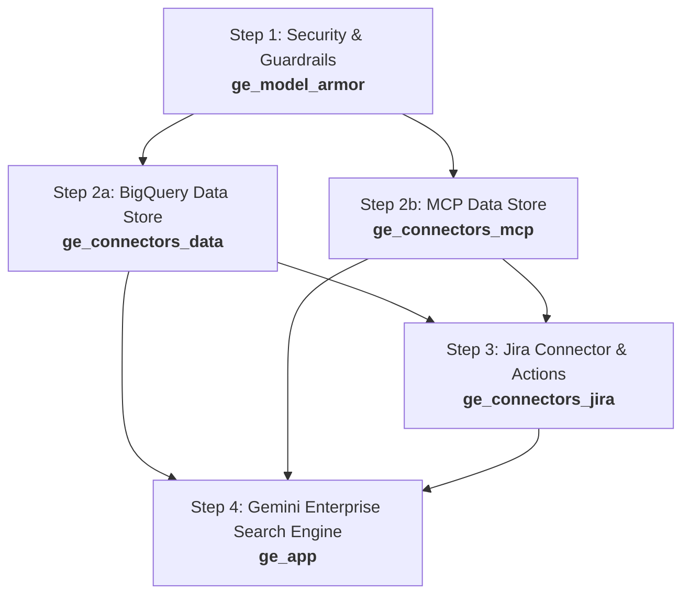

# Google Cloud Gemini Enterprise App Terraform Infrastructure

This repository contains modular Terraform configurations for provisioning and managing **Google Cloud Discovery Engine** (Gemini Enterprise) search applications, data stores, third-party data connectors (Jira, MCP, BigQuery), and **Model Armor** security guardrails.

---

## 📐 Architecture & Repository Overview

The infrastructure is organized into dedicated, modular directories to enable decoupled management and step-by-step deployment:

```
.
├── ge_model_armor/       # Model Armor security guardrails & safety templates
├── ge_connectors_data/   # Discovery Engine Data Store for BigQuery <<<<<<<<-------- NOT READY
├── ge_connectors_mcp/    # Discovery Engine Data Store for MCP / developer docs <<<<<<<<-------- NOT READY
├── ge_connectors_jira/   # Third-party federated Jira Data Connector with BAP actions
└── ge_app/               # Main Gemini Enterprise Search Engine application
```

---

## 📋 Prerequisites

Before running any module, ensure the following prerequisites are met:

1. **Terraform**: CLI version `>= 1.5.0` installed.
2. **Google Cloud SDK**: `gcloud` CLI installed and authenticated.
   ```bash
   gcloud auth application-default login
   ```
3. **GCP Project**: Active Google Cloud project (`ai-work-445217` or custom project) with billing enabled.
4. **Required GCP APIs Enabled**:
   - Discovery Engine API (`discoveryengine.googleapis.com`)
   - Model Armor API (`modelarmor.googleapis.com`)
5. **IAM Permissions**:
   - `roles/discoveryengine.admin` (Discovery Engine Admin)
   - `roles/modelarmor.admin` (Model Armor Admin)

---

## 🚀 Recommended Deployment Sequence

To satisfy resource dependencies and establish proper security controls, execute the Terraform modules in the following numerical order:



### Detailed Sequence & Rationale

| Step | Module Directory | Purpose & Rationale |
| :--- | :--- | :--- |
| **1** | [`ge_model_armor`](file:///usr/local/google/home/kapsay/work/agy-cli-projects/ge-app-tf-config/ge_model_armor) | **Security & Guardrails Layer**: Provisions Model Armor templates, prompt injection detection, Responsible AI (RAI) safety filters, malicious URI checks, and SDP/PII inspection. Must be applied first to establish governance policies. |
| **2a** | [`ge_connectors_data`](file:///usr/local/google/home/kapsay/work/agy-cli-projects/ge-app-tf-config/ge_connectors_data) | **Data Layer (BigQuery)**: Provisions the Discovery Engine Data Store for BigQuery structured data (`ecomm_events`). Data stores must exist before attaching them to the search engine. |
| **2b** | [`ge_connectors_mcp`](file:///usr/local/google/home/kapsay/work/agy-cli-projects/ge-app-tf-config/ge_connectors_mcp) | **Data Layer (MCP / Developer Docs)**: Provisions the Discovery Engine Data Store for Model Context Protocol (MCP) data (`developer-docs_1784867512211_mcp_data`). |
| **3** | [`ge_connectors_jira`](file:///usr/local/google/home/kapsay/work/agy-cli-projects/ge-app-tf-config/ge_connectors_jira) | **Integration Layer (Jira)**: Configures the federated Jira Data Connector with BAP (Business Application Platform) actions for issue management, comments, attachments, and status updates. |
| **4** | [`ge_app`](file:///usr/local/google/home/kapsay/work/agy-cli-projects/ge-app-tf-config/ge_app) | **Application Layer**: Provisions the Gemini Enterprise Search Engine app (`google_discovery_engine_search_engine`), links the Data Stores provisioned in Step 2, and configures platform features (NotebookLM, Agent Builder, Model Selector, etc.). |

---

## 📂 Module Breakdown & Documentation

### 1. `ge_model_armor`
- **Location**: [`ge_model_armor/`](file:///usr/local/google/home/kapsay/work/agy-cli-projects/ge-app-tf-config/ge_model_armor)
- **Primary Resource**: `google_model_armor_template.ge_model_armor_template` (using `google-beta` provider)
- **Key Features**:
  - **Prompt Injection & Jailbreak Detection**: Configured with enforcement level `MEDIUM_AND_ABOVE`.
  - **Malicious URI Filtering**: Enabled.
  - **Responsible AI (RAI) Safety Filters**: Hate speech, harassment, sexually explicit, and dangerous content filters (`MEDIUM_AND_ABOVE`).
  - **Sensitive Data Protection (SDP)**: Basic PII filter enforcement.
  - **Template Metadata**: `INSPECT_AND_BLOCK` enforcement with custom prompt safety error handling and multi-language detection.

### 2. `ge_connectors_data`
- **Location**: [`ge_connectors_data/`](file:///usr/local/google/home/kapsay/work/agy-cli-projects/ge-app-tf-config/ge_connectors_data)
- **Primary Resource**: `google_discovery_engine_data_store.dc_bq`
- **Key Features**:
  - Sets up a search solution type data store (`kroger_demo_ds_bq` / `ecomm_events`).
  - Document processing & layout parsing configuration disabled by default for BigQuery events.

### 3. `ge_connectors_mcp`
- **Location**: [`ge_connectors_mcp/`](file:///usr/local/google/home/kapsay/work/agy-cli-projects/ge-app-tf-config/ge_connectors_mcp)
- **Primary Resource**: `google_discovery_engine_data_store.dc_mcp`
- **Key Features**:
  - Sets up a search solution type data store (`kroger_demo_ds_mcp` / `mcp_data`).

### 4. `ge_connectors_jira`
- **Location**: [`ge_connectors_jira/`](file:///usr/local/google/home/kapsay/work/agy-cli-projects/ge-app-tf-config/ge_connectors_jira)
- **Primary Resource**: `google_discovery_engine_data_connector.jira-with-actions`
- **Key Features**:
  - Configures Atlassian Jira OAuth federated connector (`FEDERATED` and `ACTIONS` modes).
  - BAP Actions supported: `create_issue`, `update_issue`, `change_issue_status`, `create_comment`, `update_comment`, `upload_attachment`.
  - Indexed entities: `project`, `attachment`, `comment`, `issue`, `bug`, `epic`, `story`, `task`, `worklog`, `board`.

### 5. `ge_app`
- **Location**: [`ge_app/`](file:///usr/local/google/home/kapsay/work/agy-cli-projects/ge-app-tf-config/ge_app)
- **Primary Resource**: `google_discovery_engine_search_engine.kr_ge_app_tf`
- **Key Features**:
  - Configures Intranet Search App (`APP_TYPE_INTRANET`) under enterprise tier (`SUBSCRIPTION_TIER_SEARCH_AND_ASSISTANT`).
  - Attaches data store IDs (`ecomm-events_1780862168950`, `developer-docs_1784867512211_mcp_data`).
  - Enables enterprise features: Agent Gallery, Model Selector, No-Code Agent Builder, NotebookLM, Org Chart People Search, Personalization Memory.

---

## 🛠️ Step-by-Step Deployment Instructions

Run the following commands in order:

### Step 1: Deploy Model Armor Guardrails
```bash
cd ge_model_armor
terraform init
terraform plan
terraform apply
cd ..
```

### Step 2: Deploy Data Stores
```bash
# 2a. Deploy BigQuery Data Store
cd ge_connectors_data
terraform init
terraform plan
terraform apply
cd ..

# 2b. Deploy MCP Data Store
cd ge_connectors_mcp
terraform init
terraform plan
terraform apply
cd ..
```

### Step 3: Deploy Third-Party Jira Connector
```bash
cd ge_connectors_jira
terraform init
terraform plan
terraform apply
cd ..
```

### Step 4: Deploy Gemini Enterprise Search App
```bash
cd ge_app
terraform init
terraform plan
terraform apply
cd ..
```

---

## 🔒 Configuration & Variables

Each module directory contains a `terraform.tfvars` file populated with default project parameters. Customize these files prior to running `terraform apply`:

- `project_id`: Target GCP Project ID (`ai-work-445217`)
- `location`: Deployment location (`global` for Discovery Engine, `us-central1` for Model Armor)
- `collection_id`: Collection identifier (`kroger_collection`)
- `engine_id`: Search Engine App ID (`kroger_demo_app_tf`)

> [!IMPORTANT]
> Ensure sensitive variables (such as `jira_client_secret` in `ge_connectors_jira/terraform.tfvars`) are secured appropriately and not committed into public version control.
